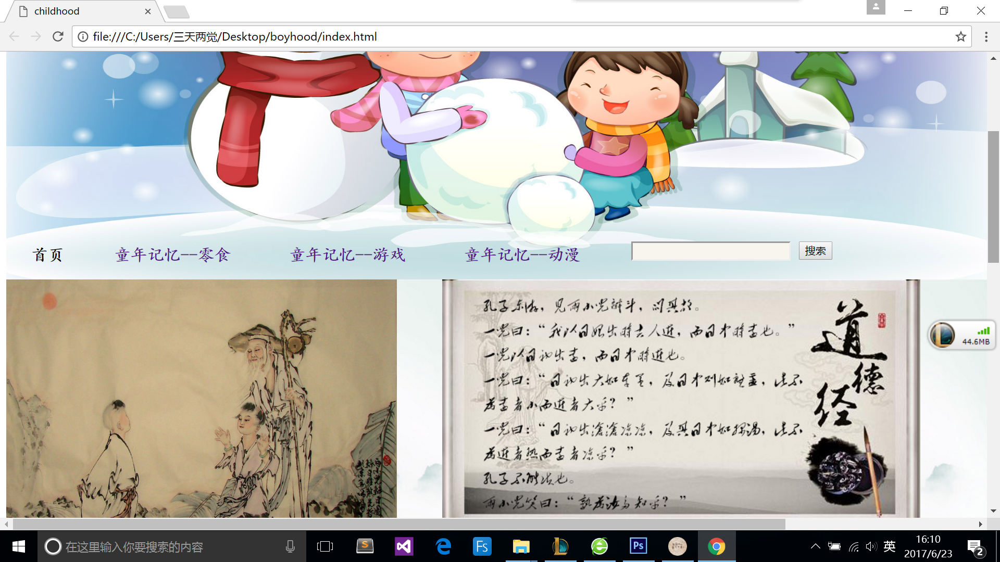
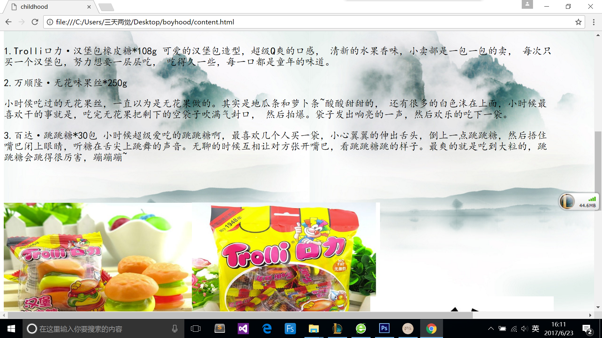
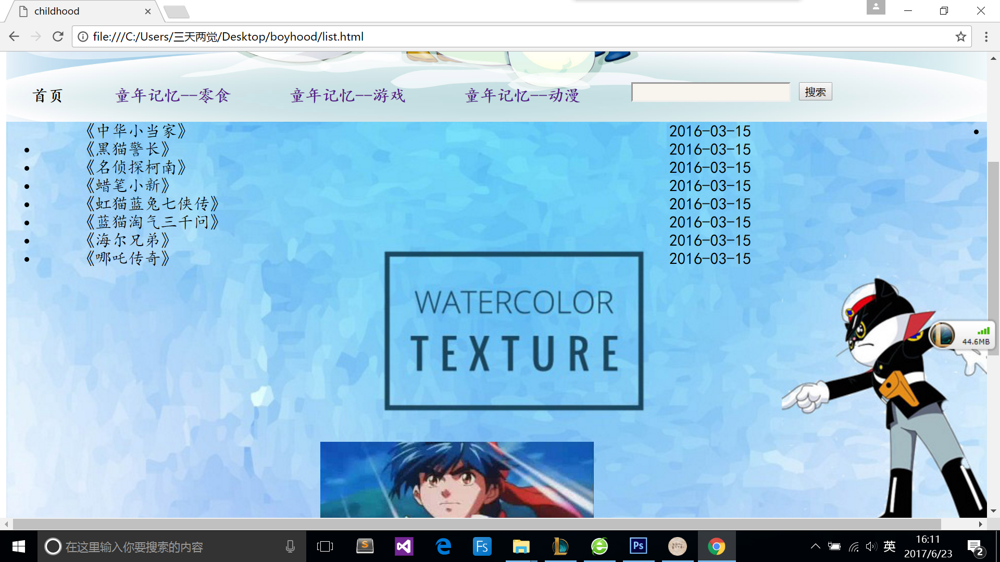
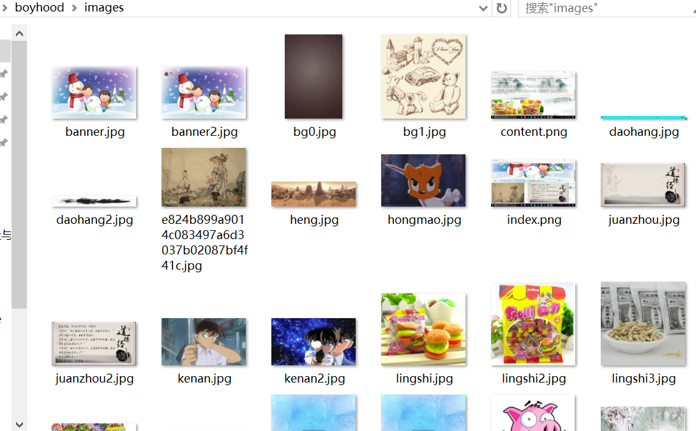
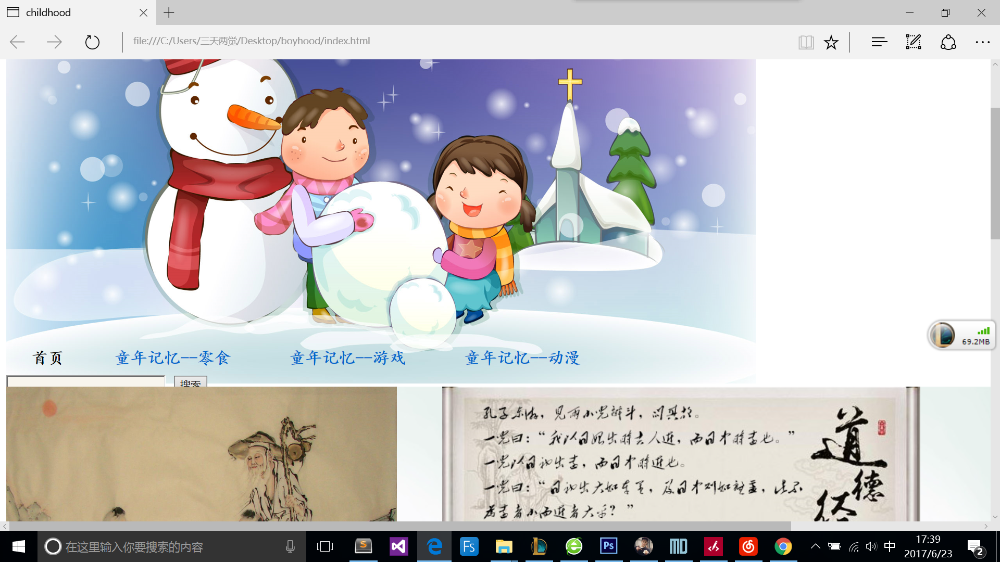
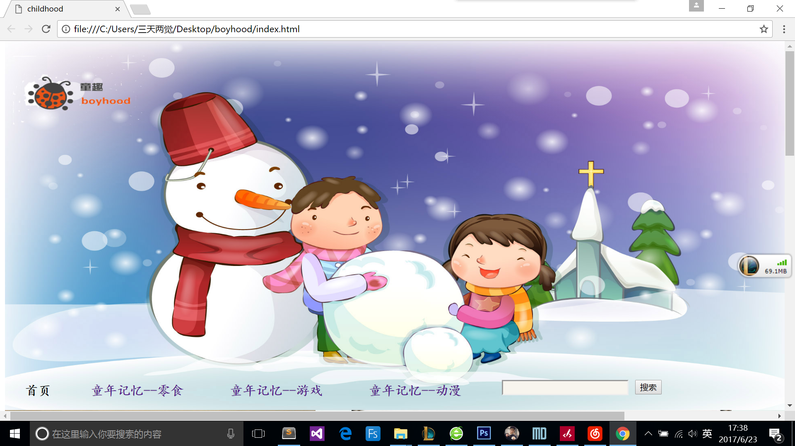

# 童趣

[2016级4班]刘兆康

设计目的：
 
- **1** ：熟练掌握HTML在组织结构上的优势。
- **2** ：熟练掌握CSS在网页布局中的应用。
- **3** ：学习Web标准及浏览器的兼容性。

### 功能性需求分析

（1）	首页：

屏幕截图：




>主要实现功能：首页导航栏功能：……  首页…… 

（2）	二级页面：


（3）	三级页面：

2.	搜集网站素材


### 代码块
首页部分
``` htmlbars

<!DOCTYPE html>
<html>
<head>
<meta charset="utf-8">
<link rel="stylesheet" type="text/css" href="css/index.css">
	<title>
	childhood
	</title>
</head>

<body>
<div id="da">
<!--页头部分-->
<div id="header">
    <!--背景-->
	<div id="bg1">

	</div>	
	<div id="nav" width="100%">
		<div id="daohang">
			<div id="daohangneirong">
					

            </div>
		</div>	
		<!--搜索框-->
			<div class="sousuo">

        	</div>
	</div>
	
	</div>


</div>
<!--页中-->
<div id="center">
	<div id="smallcenter">
		<div id="left">

		</div>
		<div id="right">

		</div>
	</div>
</div>		

<!--页尾-->
<div id="thelast">
	<div id="kuangjia">
		<div id="tupianqu">
	
		</div>

		<div id="wenziqu">
		</div>

	</div>
	
</div>


二级页面


<!DOCTYPE html>
<html>
<head>
<meta charset="utf-8">
<link rel="stylesheet" type="text/css" href="css/index.css">
	<title>
	childhood
	</title>
</head>

<body>
<div id="da">
<!--页头部分-->
<div id="header">
    <!--背景-->
	<div id="bg1">

	</div>	
	<div id="nav" width="100%">
		<div id="daohang">
			<div id="daohangneirong">
					
						


            </div>
		</div>	
		<!--搜索框-->
			<div class="sousuo">

        	</div>
	</div>
	
	</div>

</div>


<!--页中-->
<div id="center">
	<div id="smallcenter">
		<div id="biaoti">

		</div>
		<div id="all">
			<div id="left">

			</div>
			<div id="right">

			</div>
			

		</div>

	</div>

</div>	
</div>

<!--页尾-->	
<div id="banquan">

</div>	

5.	编写CSS布局及样式
（1）	CSS布局：
>核心技术：

> Float实现布局：Position辅助布局：
body{

font-size: 21px;
padding: 0px;
font-family: '楷体';
border-style: none;
list-style-type:none;
}

2）	添加CSS样式：
>通用类属性：


----------

    *{
    margin:0 auto;
    padding: 0;
    border: 0px;
	}	

6.	调试浏览器兼容性
（1）	问题1：

>在IE10+中的表现（屏幕截图）：


>在火狐中的表现（屏幕截图）：


>在Chrome中的表现（屏幕截图）：


### 问题记录
问题表现：素材稀缺，布局没有新意

### 课程小结

浏览器兼容性表现：ie浏览器定位会出现偏差


